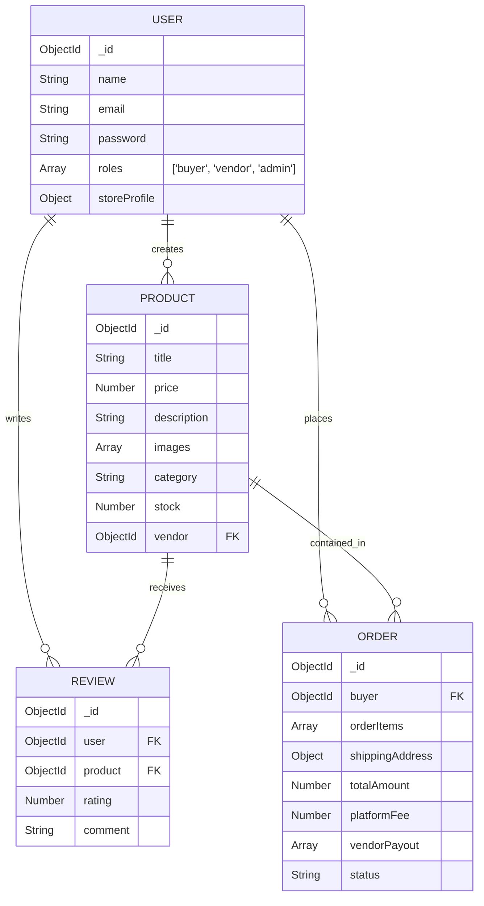
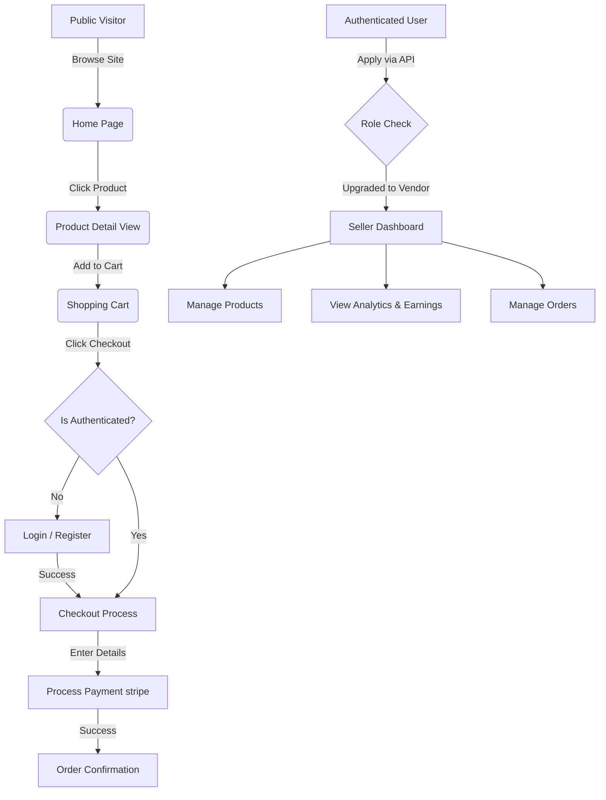

# Artisan's Corner - Multi-Vendor Marketplace

Artisan's Corner is a premium, modern multi-vendor e-commerce platform designed to connect independent creators and artisans with buyers seeking unique, handcrafted goods. 

Built with the MERN stack (MongoDB, Express, React, Node.js) and styled with Tailwind CSS v4, it features a sleek, Apple-inspired dark mode aesthetic, robust role-based access control, and seamless state management.

---

## 🚀 Features

- **Multi-Vendor System**: Distinct roles for `buyers`, `vendors`, and `admins`.
- **Vendor Dashboard**: Dedicated analytics and product management interface for sellers.
- **Modern UI/UX**: Global dark mode, glassmorphism, rounded aesthetics, and fluid animations.
- **Offline Resilience**: Graceful frontend degradation with mock data fallbacks if the backend is unreachable.
- **Authentication**: Secure JWT-based authentication.
- **State Management**: Scalable global state using Redux Toolkit.
- **Payment Processing**: Integrated with Stripe (Mock checkout capabilities enabled).

---

## 🛠️ Technology Stack

**Frontend:**
- React (Vite)
- Redux Toolkit (State Management)
- Tailwind CSS v4 (Styling)
- React Router DOM
- Axios

**Backend:**
- Node.js & Express.js
- MongoDB & Mongoose
- JSON Web Tokens (JWT)
- bcryptjs (Password Hashing)
- Cloudinary & Multer (Image Storage)
- Stripe (Payment Intents)

---

## ⚙️ Local Setup Guide

### 1. Prerequisites
- Node.js (v18+ recommended)
- MongoDB (Running locally or an Atlas connection string)
- Cloudinary Account (for image uploads)
- Stripe Account (for payments)

### 2. Clone and Install Dependencies

```bash
# Install backend dependencies
cd backend
npm install

# Install frontend dependencies
cd ../frontend
npm install
```

### 3. Environment Variables
Create a `.env` file in the `backend` directory based on the provided `.env.example`:

```env
PORT=5000
MONGO_URI=mongodb://localhost:27017/artisans-corner
JWT_SECRET=your_super_secret_jwt_key
CLOUDINARY_CLOUD_NAME=your_cloud_name
CLOUDINARY_API_KEY=your_api_key
CLOUDINARY_API_SECRET=your_api_secret
STRIPE_SECRET_KEY=your_stripe_secret
```

### 4. Run the Application

Start both servers in separate terminals:

```bash
# Terminal 1: Start Backend (Runs on http://localhost:5000)
cd backend
npm run dev

# Terminal 2: Start Frontend (Runs on http://localhost:5173)
cd frontend
npm run dev
```

---

## 🔑 Demo Login Details (Mock / Offline Mode)

If you are running the frontend without the backend connected, the app will gracefully fall back to an offline showcase mode. You can test the protected routes using these mock credentials:

**Test Buyer Account:**
- **Email:** `buyer@test.com`
- **Password:** `password123`

**Test Vendor Account:**
- **Email:** `vendor@test.com`
- **Password:** `password123`

---

## 📡 API Endpoints Overview

| Method | Endpoint | Description | Access |
| :--- | :--- | :--- | :--- |
| **Auth & Users** | | | |
| `POST` | `/api/users/register` | Register a new user | Public |
| `POST` | `/api/users/login` | Authenticate user & get token | Public |
| `GET` | `/api/users/profile` | Get user profile | Private |
| `POST` | `/api/users/become-vendor` | Upgrade buyer to vendor role | Private |
| **Products** | | | |
| `GET` | `/api/products` | Get all products | Public |
| `GET` | `/api/products/:id` | Get product details | Public |
| `POST` | `/api/products` | Create a product | Vendor/Admin |
| `GET` | `/api/products/vendor/me` | Get logged-in vendor's products | Vendor |
| **Orders** | | | |
| `POST` | `/api/orders` | Create a new order & Stripe Intent | Private |
| `GET` | `/api/orders/myorders` | Get logged-in buyer's orders | Private |
| `GET` | `/api/orders/vendor/me` | Get orders containing vendor's items | Vendor |

---

## 🗄️ Database Schema



---

## 🔄 User Flow Diagram



---

## 🤝 Contribution Guidelines

We welcome contributions to Artisan's Corner! To contribute:

1. **Fork the repository** and clone it locally.
2. **Create a new branch** for your feature or bugfix (`git checkout -b feature/amazing-feature`).
3. **Commit your changes** clearly and descriptively (`git commit -m "Add amazing feature"`).
4. **Push to the branch** (`git push origin feature/amazing-feature`).
5. **Open a Pull Request** against the `main` branch.

Please ensure your code follows the existing Tailwind v4 stylistic guidelines and that all React/Redux components remain strictly typed and well-documented.

---
*Built with ❤️ for modern web artisans.*
