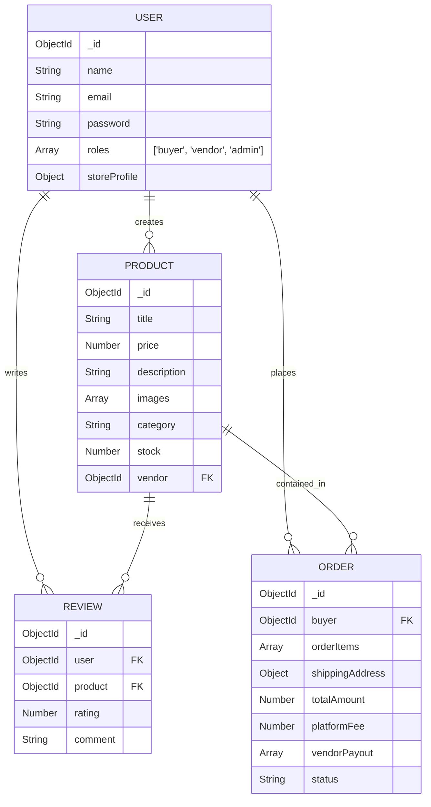
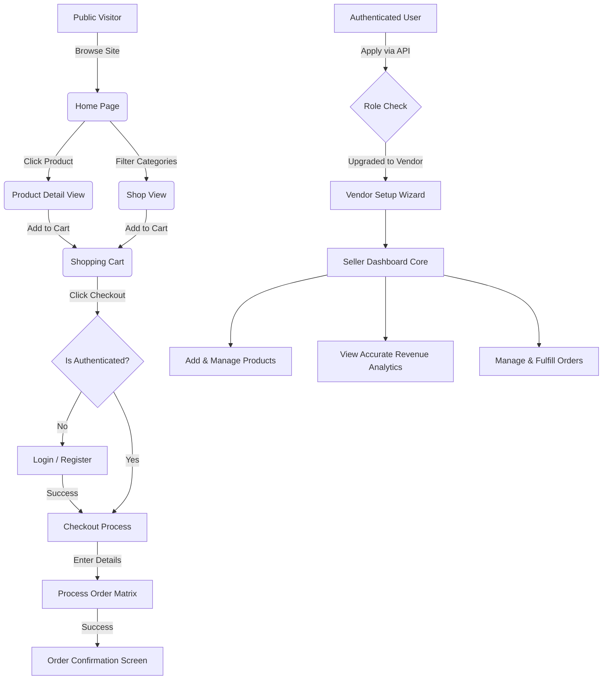

# Artisan's Corner - Multi-Vendor Marketplace

Artisan's Corner is a premium, modern multi-vendor e-commerce platform designed to connect independent creators and artisans with buyers seeking unique, handcrafted goods. 

Built with the MERN stack (MongoDB, Express, React, Node.js) and styled with Tailwind CSS v4, it features a sleek, Apple-inspired aesthetic, robust role-based access control, and seamless state management.

---

## 🚀 Key Features & Implementations

- **Multi-Vendor System**: Distinct operational flow and protected routes for `buyers`, `vendors`, and `admins`.
- **Comprehensive Vendor Dashboard**: 
  - Real-time Analytics evaluating specific vendor product sales.
  - Interactive status-filtered inventory management (`Products`, `Drafts`, `Out of Stock`).
  - Seamless `FormData` media parsing to add new products with Cloudinary integration natively handled.
  - Dedicated dynamic `Orders` layout specifically sliced to the vendor's sold items.
- **Modern Shopping Experience**:
  - Global `Shop` filtering via interactive Price ranges, Category pills, and Ratings.
  - Responsive, scaled product grids utilizing modern card component aesthetics (shadows, transitions, badging).
  - Dynamic `Homepage` showcasing Top Categories dynamically queried to the filter page, and top Featured arrays.
- **Authentication**: Secure JWT-based authentication bridging seamless transition between Buyer logic and "Become a Seller" verification routing.
- **State Management**: Scalable global state using Redux Toolkit bridging API mutations seamlessly into UI refreshes.
- **Payment Processing**: Checkout logic integrated with Order Schema generation and dynamic commission structuring (Platform vs. Vendor payouts).

---

## 🛠️ Technology Stack

**Frontend:**
- React (Vite)
- Redux Toolkit (State Management)
- Tailwind CSS v4 (Styling)
- React Router DOM
- Axios

**Backend:**
- Node.js & Express.js
- MongoDB & Mongoose
- JSON Web Tokens (JWT)
- bcryptjs (Password Hashing)
- Cloudinary & Multer (Image Storage)
- Stripe (Payment Intents placeholder/integrations)

---

## ⚙️ Local Setup Guide

### 1. Prerequisites
- Node.js (v18+ recommended)
- MongoDB (Running locally or an Atlas connection string)
- Cloudinary Account (for image uploads)

### 2. Clone and Install Dependencies

```bash
# Install backend dependencies
cd backend
npm install

# Install frontend dependencies
cd ../frontend
npm install
```

### 3. Environment Variables
Create a `.env` file in the `backend` directory based on the provided `.env.example`:

```env
PORT=5000
MONGO_URI=mongodb://localhost:27017/artisans-corner
JWT_SECRET=your_super_secret_jwt_key
CLOUDINARY_CLOUD_NAME=your_cloud_name
CLOUDINARY_API_KEY=your_api_key
CLOUDINARY_API_SECRET=your_api_secret
STRIPE_SECRET_KEY=your_stripe_secret
```

### 4. Seed the Database (Required for Demo)
To instantly populate your local store with testing products, use the included raw data file:
1. Open **MongoDB Compass**.
2. Connect to your `mongodb://localhost:27017` cluster.
3. Create a database named `artisans-corner`.
4. Create a collection named `products`.
5. Click **Add Data > Import JSON** and select the `/demo_products.json` file located in the root of this repository.

### 5. Run the Application

Start both servers in separate terminals:

```bash
# Terminal 1: Start Backend (Runs on http://localhost:5000)
cd backend
npm run dev

# Terminal 2: Start Frontend (Runs on http://localhost:5173)
cd frontend
npm run dev
```

---

## 🔑 Demo Login Details (Testing Mode)

If you are running the frontend tests gracefully to evaluate components offline or pre-backend sync, use the active seeded accounts:

**Test Buyer Account:**
- **Email:** `buyer@example.com`
- **Password:** `password123`

**Test Vendor Account:**
- **Email:** `vendor@example.com`
- **Password:** `password123`

*(Note: If migrating from mock state, make sure to register fresh DB instances through `/register` first).*

---

## 📡 Core API Endpoints Overview

| Method | Endpoint | Description | Access |
| :--- | :--- | :--- | :--- |
| **Auth & Users** | | | |
| `POST` | `/api/users/register` | Register a new user | Public |
| `POST` | `/api/users/login` | Authenticate user & get token | Public |
| `GET` | `/api/users/profile` | Get user profile | Private |
| `POST` | `/api/users/become-vendor` | Upgrade buyer to vendor role | Private |
| **Products** | | | |
| `GET` | `/api/products` | Get all products | Public |
| `GET` | `/api/products/:id` | Get product details | Public |
| `POST` | `/api/products` | Create a product via Multer | Vendor/Admin |
| `GET` | `/api/products/vendor/me` | Get logged-in vendor's products | Vendor |
| **Orders** | | | |
| `POST` | `/api/orders` | Create a new order (Checkout Flow) | Private |
| `GET` | `/api/orders/myorders` | Get logged-in buyer's orders | Private |
| `GET` | `/api/orders/vendor/me` | Get orders containing vendor's items | Vendor |

---

## 🗄️ Database Schematic Matrix



---

## 🔄 User Flow Diagrams



---

## 🤝 Contribution Guidelines

We welcome contributions to Artisan's Corner! To contribute:

1. **Fork the repository** and clone it locally.
2. **Create a new branch** for your feature or bugfix (`git checkout -b feature/amazing-feature`).
3. **Commit your changes** clearly and descriptively (`git commit -m "Add amazing feature"`).
4. **Push to the branch** (`git push origin feature/amazing-feature`).
5. **Open a Pull Request** against the `main` branch.

Please ensure your code follows the existing Tailwind v4 stylistic guidelines and that all React/Redux components remain cleanly structured.

---
*Built with ❤️ for modern web artisans.*
